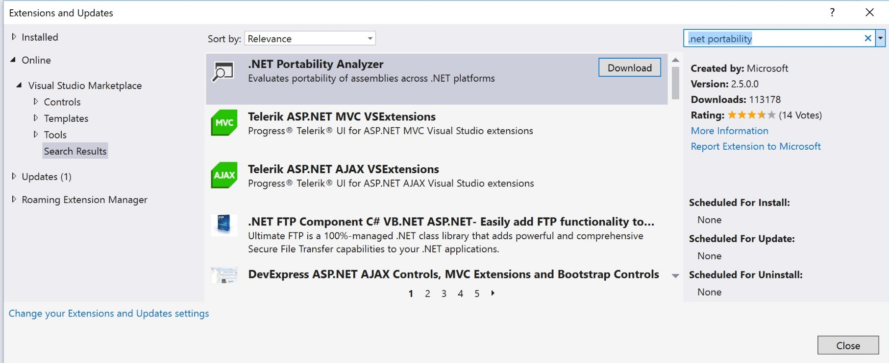
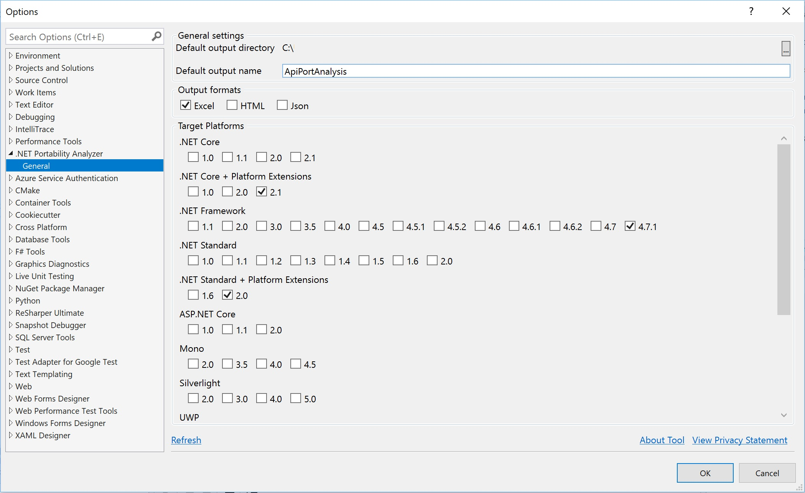
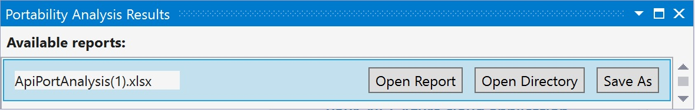
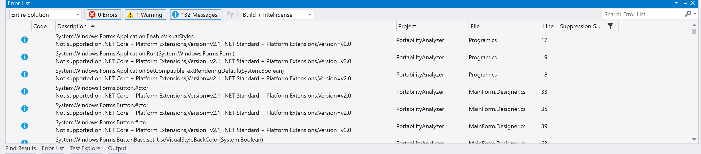

# Portability Analyzer
*By **Olia Gavrysh**, Program Manager .NET team ([email](mailto:olia.gavrysh@microsoft.com), [Twitter](https://twitter.com/oliagavrysh))*

Portability Analyzer helps porting applications between different .NET platforms (.NET Framework, .NET Core, .NET Standard, UWP, Xamarin) and versions. It analyzes your assemblies' references and identifies APIs that are not portable. The Portability Analyzer is offered as a [Visual Studio Extension](https://marketplace.visualstudio.com/items?itemName=ConnieYau.NETPortabilityAnalyzer) and as a stand-alone [console app](https://github.com/Microsoft/dotnet-apiport/releases/latest).

## Visual Studio Extension

1. **Install the extension**.

    a. Download and run Portability Analyzer installer from the [Visual Studio Marketplace](https://marketplace.visualstudio.com/items?itemName=ConnieYau.NETPortabilityAnalyzer)

    b. You can also download it from Visual Studio. Open Visual Studio, in **Tools** > **Extensions and Updates**, search for ".NET Portability Analyzer", click **Download**. Then click **Close** and close Visual Studio.

    

2. **Select your target platforms**. In Visual Studio **Analyze** > **Portability Analyzer Settings** or right-click on your solution/project and click **Portability Analyzer Settings**.

 

3. **Run the analyzer**. In Visual Studio open your application that you would like to analyze.

For this example let's download the sample source code, for which we use [PowerCollections](https://github.com/OliaG/hands-on-portability/releases/download/sample/sample_sources.zip).

To analyze your entire project, right-click on your project in Solution Explorer and select **Analyze Assembly Portability**. To analyze only particular executable or DLL, go to the **Analyze** menu and select **Analyze Assembly Portability**. From there, select what you'd like to analyze.

4. **Study the results**. To look at the .NET Portability Report click on **Open Report** in **Portability Analysis Results** window. 



To navigate to the not supported APIs in your code, in **Error List** window double-click on the information massages. 



## Console App

1. **Install the tool**. Download and unzip [Console Portability Analyzer](
https://github.com/Microsoft/dotnet-apiport/releases/download/2.5.0-alpha/ApiPort.zip)

2. **Select application to analyze**. You can download the sample application we use here, which is [Paint.NET](https://github.com/OliaG/hands-on-portability/releases/download/sample/sample_binaries.zip).

3. **Analyze application**. From the command prompt run the following command to analyze the current directory:

```
C:\Downloads\ApiPort\ApiPort.exe analyze -f C:\Downloads\sample_binaries
```

To analyze a specific list of `.dll` files, type the following command: 

```
C:\Downloads\ApiPort\ApiPort.exe analyze -f first.dll -f second.dll -f third.dll
```

You can find the portability report saved as an Excel file (`.xlsx`) in your current directory.

## Useful links

* .NET Portability Analyzer Tools
    * Console Application (.NET Framework) [Readme](https://github.com/Microsoft/dotnet-apiport/releases/tag/2.5.0-alpha), [Download](https://github.com/Microsoft/dotnet-apiport/releases/latest)
    * .NET Core Application [Readme](https://github.com/Microsoft/dotnet-apiport/blob/master/docs/Console/README.md#using-net-core-application), [Download](https://github.com/Microsoft/dotnet-apiport/)
    * Visual Studio 2017 Extension [Readme](https://github.com/Microsoft/dotnet-apiport/blob/master/docs/VSExtension/README.md), [Download](https://marketplace.visualstudio.com/items?itemName=ConnieYau.NETPortabilityAnalyzer)
* [Documentation](
https://docs.microsoft.com/en-us/dotnet/standard/analyzers/portability-analyzer)
* [Why port to .NET Core](https://blogs.msdn.microsoft.com/dotnet/2016/02/10/porting-to-net-core/)
* [Channel 9 video](https://channel9.msdn.com/Blogs/Seth-Juarez/A-Brief-Look-at-the-NET-Portability-Analyzer)